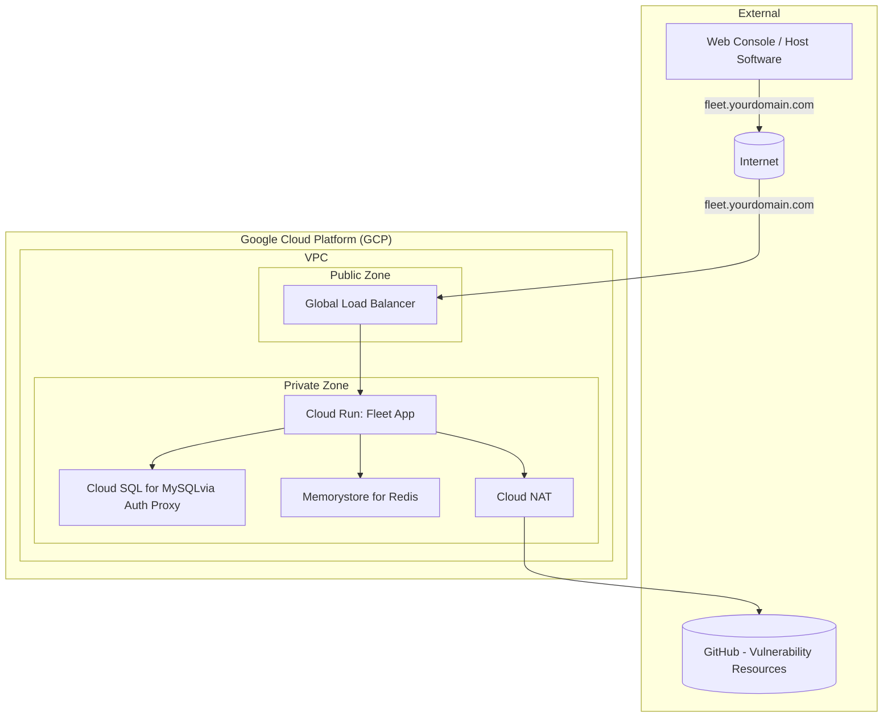

```mermaid
graph TD
    subgraph External
        Internet[(Internet)]
        Users[Web Console / Host Software]
        GitHub[(GitHub - Vulnerability Resources)]
    end

    subgraph "Google Cloud Platform (GCP)"
        subgraph VPC [VPC]
            direction LR
            subgraph PublicFacing [Public Zone]
                LB[Global Load Balancer]
            end
            subgraph PrivateZone [Private Zone]
                CloudRun[Cloud Run: Fleet App]
                CloudSQL[Cloud SQL for MySQLvia Auth Proxy]
                Redis[Memorystore for Redis]
                NAT[Cloud NAT]
            end

            CloudRun --> Redis
            CloudRun --> CloudSQL
            CloudRun --> NAT
        end
    end

    Users -- "fleet.yourdomain.com" --> Internet
    Internet -- "fleet.yourdomain.com" --> LB
    LB --> CloudRun
    NAT --> GitHub

```