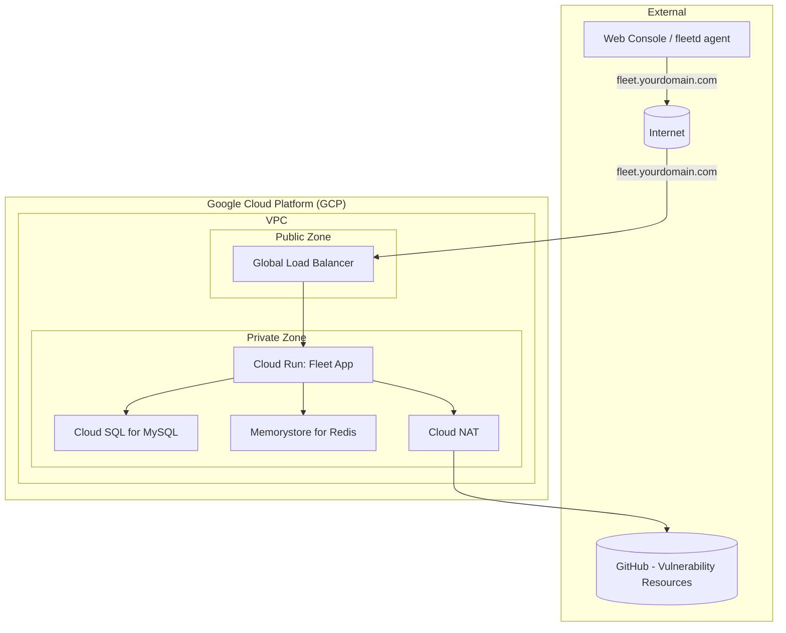

# Terraform Google Cloud Fleet Deployment

This Terraform project automates the deployment of Fleet Device Management (Fleet) on the Google Cloud Platform (GCP). By default it creates a new GCP project and deploys all necessary infrastructure components. To use an existing project instead, set `create_project = false` and provide a `project_id`.

## How to apply

**Run Terraform from this directory only** — the same place as `main.tf`, `variables.tf`, and `terraform.tfvars`.

```bash
terraform init
terraform plan
terraform apply
```

`byo-project/` is a **local module** (`source = "./byo-project"` in `main.tf`), not a separate root module. Do not `cd byo-project` and apply there — that layout does not work as a standalone stack with our wiring (root holds backend, provider, tfvars, and project selection).

It deploys:

*   A new GCP project (via `terraform-google-modules/project-factory`)
*   VPC Network and Subnets
*   Cloud NAT for outbound internet access
*   Cloud SQL for MySQL (database for Fleet)
*   Memorystore for Redis (caching for Fleet)
*   Google Cloud Storage (GCS) bucket (for Fleet software installers, S3-compatible access configured)
*   Google Secret Manager (for storing sensitive data like database passwords and Fleet server private key)
*   Cloud Run v2 Service (for the main Fleet application)
*   Cloud Run v2 Job (for database migrations)
*   External HTTP(S) Load Balancer with managed SSL certificate
*   Cloud DNS for managing the Fleet endpoint
*   Appropriate IAM service accounts and permissions

## Prerequisites

1.  **Terraform:** Version `~> 1.11` (as specified in `main.tf`).
2.  **Google Cloud SDK (`gcloud`):** Installed and configured. Install from [cloud.google.com/sdk](https://cloud.google.com/sdk/docs/install).
3.  **GCP Account & Permissions:**
    *   Credentials configured for Terraform to interact with GCP. Run `gcloud auth application-default login`.
    *   **New project** (`create_project = true`, the default): `Organization Administrator` or `Folder Creator` & `Project Creator` at the org/folder level, plus `Billing Account User` on the billing account.
    *   **Existing project** (`create_project = false`): `Owner` or `Editor` on the target project, plus `roles/dns.admin` if managing Cloud DNS.
4.  **Registered Domain Name:** You will need a domain name that you can manage DNS records for. This project will create a Cloud DNS Managed Zone for this domain (or a subdomain).
5.  **(Optional) Fleet License Key:** If you have a premium Fleet license, you can provide it via `fleet_config.license_key`.

## Configuration

1.  **Create a `terraform.tfvars` file** with at minimum:

    ```hcl
    billing_account_id = "012345-6789AB-CDEFGH"
    org_id             = "111122223333"  # or use folder_id instead
    dns_zone_name      = "gcp.example.com."
    dns_record_name    = "fleet.gcp.example.com."

    fleet_config = {
      image_tag              = "fleetdm/fleet:v4.89.2"
      fleet_cpu              = "1000m"
      fleet_memory           = "4096Mi"
      debug_logging          = false
      min_instance_count     = 1
      max_instance_count     = 5
      exec_migration         = true
      use_h2c                = false
      installers_bucket_name = "your-globally-unique-bucket-name"
      # license_key           = ""
    }
    ```

    To use an existing project instead, omit `billing_account_id` and `org_id` and set:
    ```hcl
    create_project = false
    project_id     = "your-existing-project-id"
    ```

2.  **Required variables** (no defaults — must be set):

    | Variable | Description |
    |---|---|
    | `billing_account_id` | GCP Billing Account ID. Required when `create_project = true` (the default). |
    | `org_id` or `folder_id` | Where to create the project. Required when `create_project = true`. |
    | `dns_zone_name` | DNS zone managed in Cloud DNS (e.g., `gcp.example.com.`). **Must end with a dot.** |
    | `dns_record_name` | FQDN for Fleet (e.g., `fleet.gcp.example.com.`). **Must end with a dot.** |
    | `fleet_config.installers_bucket_name` | GCS bucket name for software installers. Must be globally unique. |

    When `create_project = false`, set `project_id` instead of `billing_account_id` and `org_id`/`folder_id`.

    Review `variables.tf` and `byo-project/variables.tf` for all available options and their defaults.

## Known Limitations

1. To handle large uploads, we need to bypass GCP Cloud Run's 32MB HTTP/1 body limit by setting `fleet_config.use_h2c = true`, which forces Fleet to use HTTP/2. However, as Cloud Run documentation notes, HTTP/2 end-to-end breaks connection upgrades, affecting WebSocket support and Fleet functionality for features such as Live Queries.

    **Workaround**: [Use Fleet GitOps Flow](https://fleetdm.com/docs/using-fleet/gitops#managing-software-installers)
    * Set `fleet_config.use_h2c = false` to force HTTP/1.
    * If you have large uploads, use `fleetctl apply` with a `url` field in your software YAML. The data flow avoids the ingress limit:
        * Apply the YAML (small request).
        * The Fleet Server makes an outbound GET request to download the file from the URL (S3, GCS, etc).
        * Cloud Run doesn't apply the 32MB limit to outbound requests.

## Deployment Steps

All commands below are run from this directory, not from `byo-project/`.

1.  **Authenticate with GCP:**
    ```bash
    gcloud auth application-default login
    ```

2.  **Initialize:**
    ```bash
    terraform init
    ```

3.  **Plan the Deployment:**
    ```bash
    terraform plan
    ```

4.  **Apply the Configuration:**
    ```bash
    terraform apply
    ```
    Initial provisioning can take 10–20 minutes, primarily due to Cloud SQL instance creation and API enablement.

5.  **Update DNS (if not using Cloud DNS for the parent zone):**
    If `dns_zone_name` (e.g., `gcp.example.com.`) is a new zone created by this Terraform, and your parent domain (e.g., `example.com.`) is managed elsewhere (e.g., GoDaddy, Cloudflare), you need to delegate this new zone.
    *   Get the Name Servers (NS) records for the newly created `google_dns_managed_zone`:
        ```bash
        terraform output dns_managed_zone_name_servers
        ```
    *   Add these NS records to your parent domain's DNS settings at your registrar or DNS provider.

    **If you disabled Cloud DNS (`dns_config.enable = false`):** Manually create an A record in your DNS provider pointing to the load balancer IP output by `terraform output load_balancer_ip_address`.

## Accessing Fleet

Once the deployment is complete, migrations have run successfully, and DNS has propagated:

*   Navigate to the `dns_record_name` you configured (e.g., `https://fleet.gcp.example.com`).
*   You should be greeted by the Fleet setup page or login screen.

## Key Resources Created (within the `byo-project` module)

*   **VPC Network (`fleet-network`):** Custom network for Fleet resources.
*   **Subnet (`fleet-subnet`):** Subnetwork within the VPC.
*   **Cloud Router & NAT:** For outbound internet access from Cloud Run and other private resources.
*   **Cloud SQL for MySQL (`fleet-mysql`):** Managed MySQL database.
*   **Memorystore for Redis (`fleet-cache`):** Managed Redis instance.
*   **GCS Bucket:** For S3-compatible software installer storage.
*   **Secret Manager Secrets:** Database password, Fleet server private key, and HMAC key for GCS access.
*   **Service Account (`fleet-run-sa`):** Used by Cloud Run services/jobs with necessary permissions.
*   **Cloud Run Service:** Hosts the main Fleet application.
*   **Cloud Run Job:** Runs database migrations.
*   **External HTTP(S) Load Balancer:** Provides public HTTPS access to Fleet.
*   **Cloud DNS Managed Zone:** Manages DNS records for `dns_zone_name`.
*   **DNS A Record:** Points `dns_record_name` to the load balancer IP.

## Cleaning Up

To destroy all resources:

```bash
allow_destroy = true   # set in terraform.tfvars first
terraform apply        # apply the protection removal
terraform destroy      # then destroy
```

Setting `allow_destroy = true` disables deletion protection on Cloud SQL, GCS buckets, and KMS keys before the destroy. Without it, `terraform destroy` will fail on protected resources.

## Important Considerations

*   **Permissions:** The user or service account running Terraform needs extensive permissions, especially for project creation. For ongoing management within the project, `Project Editor` or more granular roles generally suffice.
*   **Fleet Configuration:** This Terraform setup provisions the infrastructure. Further Fleet application configuration (e.g., SSO, SMTP, agent options) is done through the Fleet UI or API after deployment.
*   **Security:**
    *   Review IAM permissions granted.
    *   The load balancer is configured for HTTPS and redirects HTTP.
    *   Cloud SQL and Memorystore are not publicly accessible and connect via Private Service Access.
*   **Scalability:** Cloud Run scaling (`min_instance_count`, `max_instance_count`) and database/cache tier can be adjusted via `fleet_config`, `database_config`, and `cache_config`.

### Networking Diagram
