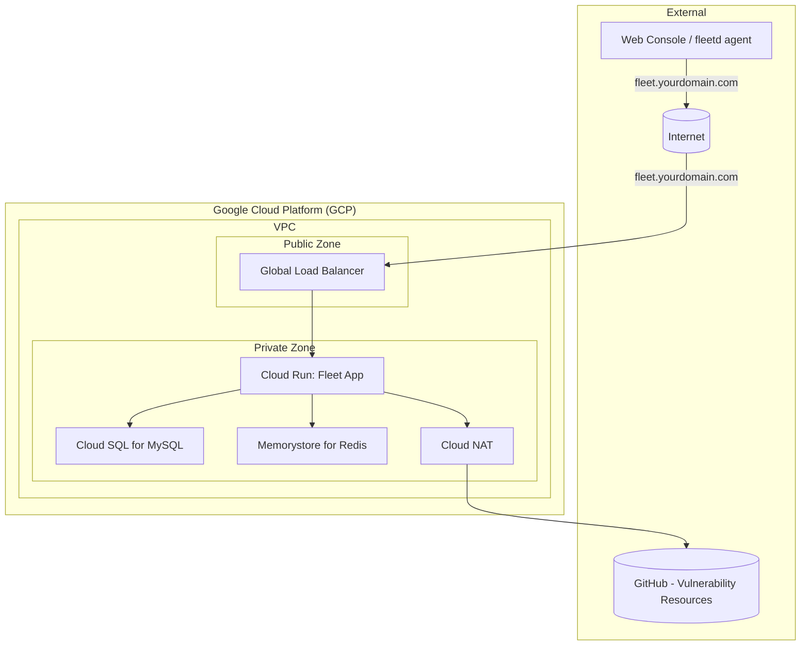

# Terraform Google Cloud Fleet Deployment

This Terraform project automates the deployment of Fleet Device Management (Fleet) on the Google Cloud Platform (GCP). By default it creates a new GCP project and deploys all necessary infrastructure components. To use an existing project instead, set `create_project = false` and provide a `project_id`.

## How to apply

**Run Terraform from this directory only** — the same place as `main.tf`, `variables.tf`, and `terraform.tfvars`.

```bash
terraform init
terraform plan
terraform apply
```

`byo-project/` is a **local module** (`source = "./byo-project"` in `main.tf`), not a separate root module. Do not `cd byo-project` and apply there — that layout does not work as a standalone stack with our wiring (root holds backend, provider, tfvars, and project selection).

It deploys:

*   A new GCP project (via `terraform-google-modules/project-factory`)
*   VPC Network and Subnets
*   Cloud NAT for outbound internet access
*   Cloud SQL for MySQL (database for Fleet)
*   Memorystore for Redis (caching for Fleet)
*   Google Cloud Storage (GCS) bucket (for Fleet software installers, S3-compatible access configured)
*   Google Secret Manager (for storing sensitive data like database passwords and Fleet server private key)
*   Cloud Run v2 Service (for the main Fleet application)
*   Cloud Run v2 Job (for database migrations)
*   External HTTP(S) Load Balancer with managed SSL certificate
*   Cloud DNS for managing the Fleet endpoint
*   Appropriate IAM service accounts and permissions

## Prerequisites

1.  **Terraform:** Version `~> 1.11` (as specified in `main.tf`).
2.  **Google Cloud SDK (`gcloud`):** Installed and configured. Install from [cloud.google.com/sdk](https://cloud.google.com/sdk/docs/install).
3.  **GCP Account & Permissions:**
    *   Credentials configured for Terraform to interact with GCP. Run `gcloud auth application-default login`.
    *   **New project** (`create_project = true`, the default): `Organization Administrator` or `Folder Creator` & `Project Creator` at the org/folder level, plus `Billing Account User` on the billing account.
    *   **Existing project** (`create_project = false`): `Owner` or `Editor` on the target project, plus `roles/dns.admin` if managing Cloud DNS.
4.  **Registered Domain Name:** You will need a domain name that you can manage DNS records for. This project will create a Cloud DNS Managed Zone for this domain (or a subdomain).
5.  **(Optional) Fleet License Key:** If you have a premium Fleet license, you can provide it via `fleet_config.license_key`.

### APIs in an existing project

New projects automatically enable the Fleet baseline APIs. For `create_project = false`, API management remains **off by default**. Either pre-enable the baseline listed in [`api-management.tf`](./api-management.tf), plus any APIs your optional configuration needs, or opt in:

```hcl
create_project               = false
project_id                   = "your-existing-project-id"
manage_existing_project_apis = true
extra_apis                   = [] # additional APIs beyond the Fleet baseline
```

With this opt-in, Terraform enables the same baseline as new projects plus `extra_apis`, and waits for those APIs before creating Fleet resources. The Terraform identity needs permission to enable services, such as `roles/serviceusage.serviceUsageAdmin`. Opting out later or destroying the stack **does not disable these APIs**. Without the opt-in, `extra_apis` does not manage APIs in an existing project; some child resources still enable their individual APIs (Redis and, when requested, KMS). Direct callers of `byo-project` must manage the remaining prerequisites themselves.

## Configuration

1.  **Create a `terraform.tfvars` file** with at minimum:

    ```hcl
    billing_account_id = "012345-6789AB-CDEFGH"
    org_id             = "111122223333"  # or use folder_id instead
    dns_zone_name      = "gcp.example.com."
    dns_record_name    = "fleet.gcp.example.com."

    fleet_config = {
      image_tag              = "fleetdm/fleet:v4.93.0"
      fleet_cpu              = "1000m"
      fleet_memory           = "4096Mi"
      debug_logging          = false
      min_instance_count     = 1
      max_instance_count     = 5
      exec_migration         = true
      use_h2c                = false
      installers_bucket_name = "your-globally-unique-bucket-name"
      # license_key           = ""
    }
    ```

    To use an existing project instead, omit `billing_account_id` and `org_id` and set:
    ```hcl
    create_project = false
    project_id     = "your-existing-project-id"
    ```

2.  **Required variables** (no defaults — must be set):

    | Variable | Description |
    |---|---|
    | `billing_account_id` | GCP Billing Account ID. Required when `create_project = true` (the default). |
    | `org_id` or `folder_id` | Where to create the project. Required when `create_project = true`. |
    | `dns_zone_name` | DNS zone managed in Cloud DNS (e.g., `gcp.example.com.`). **Must end with a dot.** |
    | `dns_record_name` | FQDN for Fleet (e.g., `fleet.gcp.example.com.`). **Must end with a dot.** |
    | `fleet_config.installers_bucket_name` | GCS bucket name for software installers. Must be globally unique. |

    When `create_project = false`, set `project_id` instead of `billing_account_id` and `org_id`/`folder_id`.

    Review `variables.tf` and `byo-project/variables.tf` for all available options and their defaults.

## Cloud Armor allowlist (optional)

`cloud_armor` attaches an optional Cloud Armor security policy to the load balancer. It is **off by default** (`cloud_armor.enable = false`), and when it is off nothing is created.

When enabled, the policy is an explicit allowlist that you own:

| Input | Effect |
|---|---|
| `allowed_ip_ranges` | Requests from these source IP ranges (CIDRs) are allowed to **any path**. |
| `allow_public_paths` | Requests whose path matches one of these RE2 regular expressions are allowed from **any source**. |
| everything else | Denied with **HTTP 403**. |

* **No Fleet endpoints are allowed automatically.** The module never adds default paths or IP ranges. You decide what is reachable.
* Either list may be empty. An IP-only policy (only `allowed_ip_ranges`) is valid. Enabling the policy with **both** lists empty is rejected at plan time, because it would return 403 for every request.
* **IP-only policies block devices outside those ranges.** With no `allow_public_paths`, fleetd/osquery agents and MDM-enrolled devices can reach Fleet only if their traffic comes from a listed range (for example, a VPN or office egress). Devices anywhere else get 403, so enrollment, check-ins, and MDM commands fail for them.
* `allow_public_paths` entries are RE2 regexes matched against the request path. Anchor them with `^` so they only match the intended path prefix. Each regex is passed to Cloud Armor as an escaped CEL string literal, so quotes and backslashes are safe and keep their regex meaning. In HCL, write a regex backslash as `\\` (for example, `"^/api/v\\d+/"`).
* Rules are chunked to fit Cloud Armor limits: up to 5 path regexes per rule (priorities 1000, 1010, …) and up to 10 IP ranges per rule (priorities 2000, 2010, …). The deny-all rule is the policy's default rule at priority 2147483647.
* Only `tier = "STANDARD"` is implemented. `tier = "ENTERPRISE"` is rejected when the policy is enabled.

### Choosing public paths

Which paths your devices need depends on the Fleet features you use (osquery/fleetd, Fleet Desktop, Apple/Windows/Android MDM, and so on). Use Fleet's guide [What API endpoints to expose to the public internet?](https://fleetdm.com/guides/what-api-endpoints-to-expose-to-the-public-internet) as a feature-by-feature starting point. Treat it as a reference, not an exhaustive or version-locked list, and confirm the paths against the Fleet version you run:

* Paths in the guide can differ from Fleet's server routes. For example, Fleet serves its ACME endpoints under `/api/mdm/acme/{identifier}/...`. A pattern for that route is `^/api/mdm/acme/[^/]+/`.
* fleetd's update (TUF) repository is normally not served by this load balancer. By default, fleetd downloads updates from `updates.fleetdm.com` (or from your own TUF server), so TUF paths usually do not belong in this list.

After enabling, check the load balancer logs for 403 responses from managed devices and adjust the list.

### Requirements and limitations

* **Regional load balancer only.** Cloud Armor is currently wired only for the regional external Application Load Balancer. `cloud_armor.enable = true` requires `load_balancer_config.enable = true` and `load_balancer_config.use_regional_lb = true`. The global load balancer path is not supported.
* **Native Terraform attachment.** The regional backend uses `google-beta`'s `security_policy` field. Attachment, detachment, and drift are tracked by Terraform; no `gcloud` command or separate CLI login is required. The policy's allow/deny rules are configured before attachment.
* **Upgrade before disabling an older draft policy.** If an existing deployment used the previous `null_resource`/`gcloud` attachment, first apply this version with Cloud Armor still enabled and its configuration unchanged. That records the native attachment and detach-before-delete ordering in state. Only on a subsequent apply should you disable Cloud Armor or destroy the deployment. The old provisioner is forgotten without running its detach command; skipping this intermediate upgrade can leave GCP refusing to delete a still-attached policy.

### Examples

IP-only: admins and devices must all come from the listed ranges.

```hcl
load_balancer_config = {
  use_regional_lb = true
}

cloud_armor = {
  enable            = true
  allowed_ip_ranges = ["203.0.113.0/24", "198.51.100.7/32"]
}
```

Admin IP ranges plus explicit public device paths:

```hcl
load_balancer_config = {
  use_regional_lb = true
}

cloud_armor = {
  enable            = true
  allowed_ip_ranges = ["203.0.113.0/24"] # any path from these sources

  # Illustrative, not complete: build this list from the Fleet guide above
  # for the features you use, and verify it against your Fleet version.
  allow_public_paths = [
    "^/api/(v1/)?osquery/",
    "^/api/fleet/orbit/",
    "^/api/mdm/acme/[^/]+/",
  ]
}
```

## Customer-managed encryption (CMEK)

CMEK uses Google Cloud KMS keys for encryption at rest, analogous to AWS KMS customer-managed keys. All new service options below are **unset/off by default**, independently of the existing GCS setting. Setting `cmek.enable = true` still enables **GCS-only** encryption; it does not opt existing databases, caches, services, or secrets into new encryption changes.

| Configuration | Scope | Required key location | Existing-resource consequence |
|---|---|---|---|
| `enable`, `create_kms`, `kms_key_ring`, `kms_crypto_key` | Existing GCS bucket encryption configuration; optionally creates its key | `location`, matching the bucket | Existing objects are not retroactively re-encrypted |
| `cloud_sql.kms_key_id` | Cloud SQL instance | `region` | **Instance replacement**; migrate/back up data before enabling |
| `redis.kms_key_id` | Memorystore Redis instance | `region` | **Instance replacement** |
| `cloud_run.kms_key_id` | Fleet service and migration job | `region` | Service revision/job template update |
| `secret_manager.kms_key_id` | Managed secrets with automatic replication | `global` | **Managed secret replacement** with the same IDs under the pinned provider |
| `secret_manager.replica_kms_key_ids` | Managed secrets with `replicate_secrets` set | One key in each replica's region | **Managed secret replacement** with the same IDs under the pinned provider |

The new consumers accept **full key IDs** for keys provisioned separately or by the caller's Terraform configuration; they do not create additional keys. The deployer must be allowed to grant key access to each service's Google-managed service agent. API enablement is a prerequisite, particularly for existing projects; use the opt-in above or pre-enable the required services. A regional key cannot be replaced by the default multi-region GCS key, and a global Secret Manager key cannot be used for a regional service.

For example, for an encrypted fresh provision using existing keys and regional secret replication:

```hcl
region            = "us-central1"
replicate_secrets = ["us-central1"]

cmek = {
  # GCS remains separately opt-in through enable/kms_key_ring/kms_crypto_key.
  cloud_sql = {
    kms_key_id = "projects/YOUR_PROJECT_ID/locations/us-central1/keyRings/fleet/cryptoKeys/database"
  }
  redis = {
    kms_key_id = "projects/YOUR_PROJECT_ID/locations/us-central1/keyRings/fleet/cryptoKeys/cache"
  }
  cloud_run = {
    kms_key_id = "projects/YOUR_PROJECT_ID/locations/us-central1/keyRings/fleet/cryptoKeys/run"
  }
  secret_manager = {
    replica_kms_key_ids = {
      us-central1 = "projects/YOUR_PROJECT_ID/locations/us-central1/keyRings/fleet/cryptoKeys/secrets"
    }
  }
}
```

With automatic replication (`replicate_secrets = []`), use `secret_manager = { kms_key_id = "projects/YOUR_PROJECT_ID/locations/global/keyRings/fleet/cryptoKeys/secrets" }` instead. Regional replication requires a key for every configured replica; the module does not silently leave any managed replica unencrypted. External private-key secrets and `extra_secret_env_vars` remain caller-managed and are not modified by this configuration.

**Review the plan before upgrading.** Opting an existing SQL or Redis instance into CMEK is not a safe in-place migration. Changing managed-secret replication encryption replaces those secrets under the pinned provider and recreates current values from Terraform; historical versions are not preserved by that replacement. Back up required versions before making this change. These settings do not enable database/Redis TLS, create an Artifact Registry repository, certify compliance, or bypass organization policies. The Cloud Run invoker still uses an `allUsers` IAM member, which restrictive domain policies may reject. Use a compatible image supplied through `fleet_config.image_tag`; validate the image and encryption configuration in your target GCP environment.

## Installer-bucket versioning and retention

Versioning is optional and **off by default**, matching the AWS Terraform modules. The existing bucket name remains `fleet_config.installers_bucket_name`.

```hcl
software_installers_config = {
  enable_bucket_versioning           = true
  expire_noncurrent_versions         = true # opt out with false
  noncurrent_version_expiration_days = 30
}
```

When versioning is enabled, noncurrent-version expiry defaults on after 30 days. The lifecycle targets **archived/noncurrent versions only**, never the live installer object. Disable expiry to retain all versions indefinitely. With versioning off, this module adds no expiry rule. Enabling expiry on an existing versioned bucket can delete versions already older than the configured window; `allow_destroy` does not prevent lifecycle expiry. Applying the new default to a previously versioned draft deployment suspends versioning without deleting its retained versions.

## Upgrade notes

* Legacy project creation remains the default. Keep `create_project = true` for projects managed by this module; do not switch to the existing-project path as a shortcut, because removing project-factory ownership can affect the project and its services.
* The database default remains `fleet-mysql`. If a draft deployment was created with `fleet-mysql-v2`, explicitly retain that name in `database_config` before upgrading, or Terraform will propose replacement.
* The regional load balancer now shares one reserved IP for HTTP and HTTPS, including when `create_static_ip = false`. Previously ephemeral draft deployments may change IP; update external DNS and review the plan.
* Duplicate regional invoker ownership and the unused packages mirror are forgotten without remote deletion. New deployments no longer create the mirror. Operators retaining an old mirror must manage it separately.
* `backend_timeout_sec` is an unsupported legacy input: serverless NEG backends do not accept a configurable backend timeout. The Fleet Cloud Run service timeout remains 300 seconds; this input does not change it.

## Known Limitations

1. To handle large uploads, we need to bypass GCP Cloud Run's 32MB HTTP/1 body limit by setting `fleet_config.use_h2c = true`, which forces Fleet to use HTTP/2. However, as Cloud Run documentation notes, HTTP/2 end-to-end breaks connection upgrades, affecting WebSocket support and Fleet functionality for features such as Live Queries.

    **Workaround**: [Use Fleet GitOps Flow](https://fleetdm.com/docs/using-fleet/gitops#managing-software-installers)
    * Set `fleet_config.use_h2c = false` to force HTTP/1.
    * If you have large uploads, use `fleetctl apply` with a `url` field in your software YAML. The data flow avoids the ingress limit:
        * Apply the YAML (small request).
        * The Fleet Server makes an outbound GET request to download the file from the URL (S3, GCS, etc).
        * Cloud Run doesn't apply the 32MB limit to outbound requests.

## Deployment Steps

All commands below are run from this directory, not from `byo-project/`.

1.  **Authenticate with GCP:**
    ```bash
    gcloud auth application-default login
    ```

2.  **Initialize:**
    ```bash
    terraform init
    ```

3.  **Plan the Deployment:**
    ```bash
    terraform plan
    ```

4.  **Apply the Configuration:**
    ```bash
    terraform apply
    ```
    Initial provisioning can take 10–20 minutes, primarily due to Cloud SQL instance creation and API enablement.

5.  **Update DNS (if not using Cloud DNS for the parent zone):**
    If `dns_zone_name` (e.g., `gcp.example.com.`) is a new zone created by this Terraform, and your parent domain (e.g., `example.com.`) is managed elsewhere (e.g., GoDaddy, Cloudflare), you need to delegate this new zone.
    *   Get the Name Servers (NS) records for the newly created `google_dns_managed_zone`:
        ```bash
        terraform output dns_managed_zone_name_servers
        ```
    *   Add these NS records to your parent domain's DNS settings at your registrar or DNS provider.

    **If you disabled Cloud DNS (`dns_config.enable = false`):** Manually create an A record in your DNS provider pointing to the load balancer IP output by `terraform output load_balancer_ip_address`.

## Accessing Fleet

Once the deployment is complete, migrations have run successfully, and DNS has propagated:

*   Navigate to the `dns_record_name` you configured (e.g., `https://fleet.gcp.example.com`).
*   You should be greeted by the Fleet setup page or login screen.

## Key Resources Created (within the `byo-project` module)

*   **VPC Network (`fleet-network`):** Custom network for Fleet resources.
*   **Subnet (`fleet-subnet`):** Subnetwork within the VPC.
*   **Cloud Router & NAT:** For outbound internet access from Cloud Run and other private resources.
*   **Cloud SQL for MySQL (`fleet-mysql`):** Managed MySQL database.
*   **Memorystore for Redis (`fleet-cache`):** Managed Redis instance.
*   **GCS Bucket:** For S3-compatible software installer storage.
*   **Secret Manager Secrets:** Database password, Fleet server private key, and HMAC key for GCS access.
*   **Service Account (`fleet-run-sa`):** Used by Cloud Run services/jobs with necessary permissions.
*   **Cloud Run Service:** Hosts the main Fleet application.
*   **Cloud Run Job:** Runs database migrations.
*   **External HTTP(S) Load Balancer:** Provides public HTTPS access to Fleet.
*   **Cloud DNS Managed Zone:** Manages DNS records for `dns_zone_name`.
*   **DNS A Record:** Points `dns_record_name` to the load balancer IP.

## Cleaning Up

To destroy all resources:

```bash
allow_destroy = true   # set in terraform.tfvars first
terraform apply        # apply the protection removal
terraform destroy      # then destroy
```

Setting `allow_destroy = true` disables Cloud SQL's Terraform deletion protection and allows deletion of objects in non-empty GCS buckets during destroy. Apply that change before destroying. It does not control KMS protection: key rings/key names remain reserved by GCP, and managed key versions have a destruction window (30 days by default). With `allow_destroy = false`, an unprotected database or an empty bucket may still be destroyed; this is not a universal destroy guard.

## Important Considerations

*   **Permissions:** The user or service account running Terraform needs extensive permissions, especially for project creation. For ongoing management within the project, `Project Editor` or more granular roles generally suffice.
*   **Fleet Configuration:** This Terraform setup provisions the infrastructure. Further Fleet application configuration (e.g., SSO, SMTP, agent options) is done through the Fleet UI or API after deployment.
*   **Security:**
    *   Review IAM permissions granted.
    *   With the default managed certificate and `https_redirect = true`, the load balancer provides HTTPS and redirects HTTP. Disabling the regional managed certificate also requires disabling HTTPS redirects; that configuration is HTTP-only.
    *   Cloud SQL and Memorystore are not publicly accessible and connect via Private Service Access.
*   **Scalability:** Cloud Run scaling (`min_instance_count`, `max_instance_count`) and database/cache tier can be adjusted via `fleet_config`, `database_config`, and `cache_config`.

### Networking Diagram

```mermaid
graph TD
    subgraph External
        Internet[(Internet)]
        Users[Web Console / fleetd agent]
        GitHub[(GitHub - Vulnerability Resources)]
    end

    subgraph "Google Cloud Platform (GCP)"
        subgraph VPC [VPC]
            direction LR
            subgraph PublicFacing [Public Zone]
                LB[Global Load Balancer]
            end
            subgraph PrivateZone [Private Zone]
                CloudRun[Cloud Run: Fleet App]
                CloudSQL[Cloud SQL for MySQL]
                Redis[Memorystore for Redis]
                NAT[Cloud NAT]
            end

            CloudRun --> Redis
            CloudRun --> CloudSQL
            CloudRun --> NAT
        end
    end

    Users -- "fleet.yourdomain.com" --> Internet
    Internet -- "fleet.yourdomain.com" --> LB
    LB --> CloudRun
    NAT --> GitHub

```