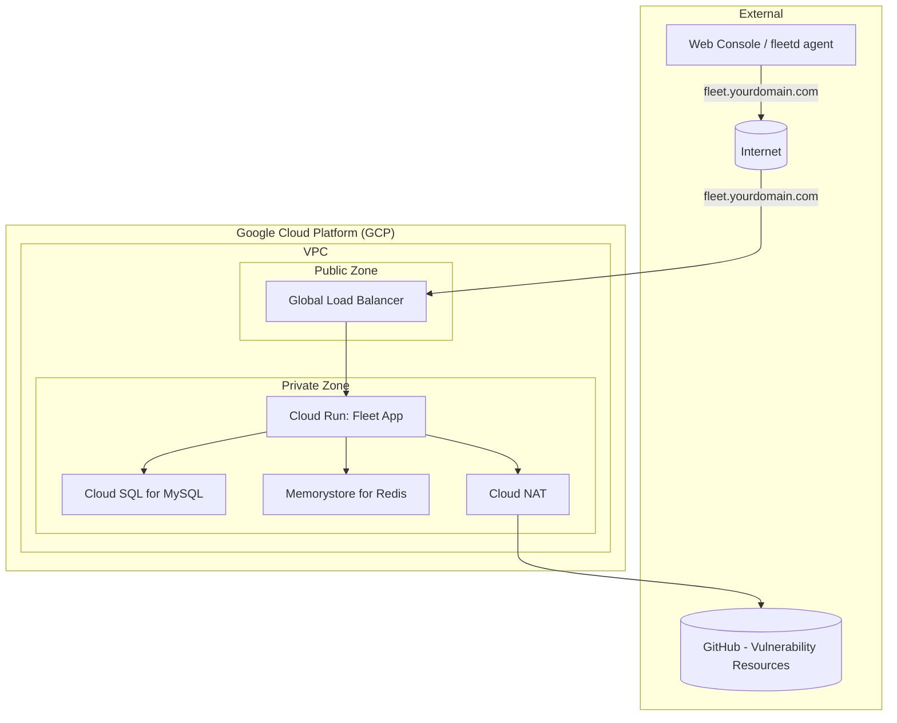

# Terraform Google Cloud Fleet Deployment

This Terraform project automates the deployment of Fleet Device Management (Fleet) on the Google Cloud Platform (GCP). By default it creates a new GCP project and deploys all necessary infrastructure components. To use an existing project instead, set `create_project = false` and provide a `project_id`.

## How to apply

**Run Terraform from this directory only** — the same place as `main.tf`, `variables.tf`, and `terraform.tfvars`.

```bash
terraform init
terraform plan
terraform apply
```

`byo-project/` is a **local module** (`source = "./byo-project"` in `main.tf`), not a separate root module. Do not `cd byo-project` and apply there — that layout does not work as a standalone stack with our wiring (root holds backend, provider, tfvars, and project selection).

It deploys:

*   A new GCP project (via `terraform-google-modules/project-factory`)
*   VPC Network and Subnets
*   Cloud NAT for outbound internet access
*   Cloud SQL for MySQL (database for Fleet)
*   Memorystore for Redis (caching for Fleet)
*   Google Cloud Storage (GCS) bucket (for Fleet software installers, S3-compatible access configured)
*   Google Secret Manager (for storing sensitive data like database passwords and Fleet server private key)
*   Cloud Run v2 Service (for the main Fleet application)
*   Cloud Run v2 Job (for database migrations)
*   External HTTP(S) Load Balancer with managed SSL certificate
*   Cloud DNS for managing the Fleet endpoint
*   Appropriate IAM service accounts and permissions

## Prerequisites

1.  **Terraform:** Version `~> 1.11` (as specified in `main.tf`).
2.  **Google Cloud SDK (`gcloud`):** Installed and configured. Install from [cloud.google.com/sdk](https://cloud.google.com/sdk/docs/install).
3.  **GCP Account & Permissions:**
    *   Credentials configured for Terraform to interact with GCP. Run `gcloud auth application-default login`.
    *   **New project** (`create_project = true`, the default): `Organization Administrator` or `Folder Creator` & `Project Creator` at the org/folder level, plus `Billing Account User` on the billing account.
    *   **Existing project** (`create_project = false`): `Owner` or `Editor` on the target project, plus `roles/dns.admin` if managing Cloud DNS.
4.  **Registered Domain Name:** You will need a domain name that you can manage DNS records for. This project will create a Cloud DNS Managed Zone for this domain (or a subdomain).
5.  **(Optional) Fleet License Key:** If you have a premium Fleet license, you can provide it via `fleet_config.license_key`.

## Configuration

1.  **Create a `terraform.tfvars` file** with at minimum:

    ```hcl
    billing_account_id = "012345-6789AB-CDEFGH"
    org_id             = "111122223333"  # or use folder_id instead
    dns_zone_name      = "gcp.example.com."
    dns_record_name    = "fleet.gcp.example.com."

    fleet_config = {
      image_tag              = "fleetdm/fleet:v4.89.2"
      fleet_cpu              = "1000m"
      fleet_memory           = "4096Mi"
      debug_logging          = false
      min_instance_count     = 1
      max_instance_count     = 5
      exec_migration         = true
      use_h2c                = false
      installers_bucket_name = "your-globally-unique-bucket-name"
      # license_key           = ""
    }
    ```

    To use an existing project instead, omit `billing_account_id` and `org_id` and set:
    ```hcl
    create_project = false
    project_id     = "your-existing-project-id"
    ```

2.  **Required variables** (no defaults — must be set):

    | Variable | Description |
    |---|---|
    | `billing_account_id` | GCP Billing Account ID. Required when `create_project = true` (the default). |
    | `org_id` or `folder_id` | Where to create the project. Required when `create_project = true`. |
    | `dns_zone_name` | DNS zone managed in Cloud DNS (e.g., `gcp.example.com.`). **Must end with a dot.** |
    | `dns_record_name` | FQDN for Fleet (e.g., `fleet.gcp.example.com.`). **Must end with a dot.** |
    | `fleet_config.installers_bucket_name` | GCS bucket name for software installers. Must be globally unique. |

    When `create_project = false`, set `project_id` instead of `billing_account_id` and `org_id`/`folder_id`.

    Review `variables.tf` and `byo-project/variables.tf` for all available options and their defaults.

## Known Limitations

1. To handle large uploads, we need to bypass GCP Cloud Run's 32MB HTTP/1 body limit by setting `fleet_config.use_h2c = true`, which forces Fleet to use HTTP/2. However, as Cloud Run documentation notes, HTTP/2 end-to-end breaks connection upgrades, affecting WebSocket support and Fleet functionality for features such as Live Queries.

    **Workaround**: [Use Fleet GitOps Flow](https://fleetdm.com/docs/using-fleet/gitops#managing-software-installers)
    * Set `fleet_config.use_h2c = false` to force HTTP/1.
    * If you have large uploads, use `fleetctl apply` with a `url` field in your software YAML. The data flow avoids the ingress limit:
        * Apply the YAML (small request).
        * The Fleet Server makes an outbound GET request to download the file from the URL (S3, GCS, etc).
        * Cloud Run doesn't apply the 32MB limit to outbound requests.

## Deployment Steps

All commands below are run from this directory, not from `byo-project/`.

1.  **Authenticate with GCP:**
    ```bash
    gcloud auth application-default login
    ```

2.  **Initialize:**
    ```bash
    terraform init
    ```

3.  **Plan the Deployment:**
    ```bash
    terraform plan
    ```

4.  **Apply the Configuration:**
    ```bash
    terraform apply
    ```
    Initial provisioning can take 10–20 minutes, primarily due to Cloud SQL instance creation and API enablement.

5.  **Update DNS (if not using Cloud DNS for the parent zone):**
    If `dns_zone_name` (e.g., `gcp.example.com.`) is a new zone created by this Terraform, and your parent domain (e.g., `example.com.`) is managed elsewhere (e.g., GoDaddy, Cloudflare), you need to delegate this new zone.
    *   Get the Name Servers (NS) records for the newly created `google_dns_managed_zone`:
        ```bash
        terraform output dns_managed_zone_name_servers
        ```
    *   Add these NS records to your parent domain's DNS settings at your registrar or DNS provider.

    **If you disabled Cloud DNS (`dns_config.enable = false`):** Manually create an A record in your DNS provider pointing to the load balancer IP output by `terraform output load_balancer_ip_address`.

## Accessing Fleet

Once the deployment is complete, migrations have run successfully, and DNS has propagated:

*   Navigate to the `dns_record_name` you configured (e.g., `https://fleet.gcp.example.com`).
*   You should be greeted by the Fleet setup page or login screen.

## Key Resources Created (within the `byo-project` module)

*   **VPC Network (`fleet-network`):** Custom network for Fleet resources.
*   **Subnet (`fleet-subnet`):** Subnetwork within the VPC.
*   **Cloud Router & NAT:** For outbound internet access from Cloud Run and other private resources.
*   **Cloud SQL for MySQL (`fleet-mysql`):** Managed MySQL database.
*   **Memorystore for Redis (`fleet-cache`):** Managed Redis instance.
*   **GCS Bucket:** For S3-compatible software installer storage.
*   **Secret Manager Secrets:** Database password, Fleet server private key, and HMAC key for GCS access.
*   **Service Account (`fleet-run-sa`):** Used by Cloud Run services/jobs with necessary permissions.
*   **Cloud Run Service:** Hosts the main Fleet application.
*   **Cloud Run Job:** Runs database migrations.
*   **External HTTP(S) Load Balancer:** Provides public HTTPS access to Fleet.
*   **Cloud DNS Managed Zone:** Manages DNS records for `dns_zone_name`.
*   **DNS A Record:** Points `dns_record_name` to the load balancer IP.

## Cleaning Up

To destroy all resources:

```bash
allow_destroy = true   # set in terraform.tfvars first
terraform apply        # apply the protection removal
terraform destroy      # then destroy
```

Setting `allow_destroy = true` disables deletion protection on Cloud SQL, GCS buckets, and KMS keys before the destroy. Without it, `terraform destroy` will fail on protected resources.

## Important Considerations

*   **Permissions:** The user or service account running Terraform needs extensive permissions, especially for project creation. For ongoing management within the project, `Project Editor` or more granular roles generally suffice.
*   **Fleet Configuration:** This Terraform setup provisions the infrastructure. Further Fleet application configuration (e.g., SSO, SMTP, agent options) is done through the Fleet UI or API after deployment.
*   **Security:**
    *   Review IAM permissions granted.
    *   The load balancer is configured for HTTPS and redirects HTTP.
    *   Cloud SQL and Memorystore are not publicly accessible and connect via Private Service Access.
*   **Scalability:** Cloud Run scaling (`min_instance_count`, `max_instance_count`) and database/cache tier can be adjusted via `fleet_config`, `database_config`, and `cache_config`.

### Networking Diagram


## Requirements

| Name | Version |
|------|---------|
| <a name="requirement_terraform"></a> [terraform](#requirement\_terraform) | ~> 1.11 |
| <a name="requirement_google"></a> [google](#requirement\_google) | >= 6.35.0 |

## Providers

No providers.

## Modules

| Name | Source | Version |
|------|--------|---------|
| <a name="module_fleet"></a> [fleet](#module\_fleet) | ./byo-project | n/a |
| <a name="module_project_factory"></a> [project\_factory](#module\_project\_factory) | terraform-google-modules/project-factory/google | ~> 18.0.0 |

## Resources

No resources.

## Inputs

| Name | Description | Type | Default | Required |
|------|-------------|------|---------|:--------:|
| <a name="input_allow_destroy"></a> [allow\_destroy](#input\_allow\_destroy) | When true, disables deletion protection on all resources so a full<br/>`terraform destroy` can proceed:<br/>  - Cloud SQL: deletion\_protection = false<br/>  - GCS buckets: force\_destroy = true<br/>  - KMS crypto key: prevent\_destroy is not enforced (GCP still applies a<br/>    configurable destruction window, default 30 days, before key versions<br/>    are permanently deleted)<br/><br/>Keep false in production. Set true only when tearing down the environment.<br/>When allow\_destroy overrides database\_config.deletion\_protection, the more<br/>permissive value (false) wins. | `bool` | `false` | no |
| <a name="input_billing_account_id"></a> [billing\_account\_id](#input\_billing\_account\_id) | GCP Billing Account ID (required when create\_project=true) | `string` | `null` | no |
| <a name="input_cache_config"></a> [cache\_config](#input\_cache\_config) | Configuration for the Memorystore (Redis) instance. | <pre>object({<br/>    name           = string<br/>    tier           = string<br/>    engine_version = string<br/>    connect_mode   = string<br/>    memory_size    = number<br/>  })</pre> | <pre>{<br/>  "connect_mode": "PRIVATE_SERVICE_ACCESS",<br/>  "engine_version": null,<br/>  "memory_size": 1,<br/>  "name": "fleet-cache",<br/>  "tier": "STANDARD_HA"<br/>}</pre> | no |
| <a name="input_cloud_armor"></a> [cloud\_armor](#input\_cloud\_armor) | n/a | <pre>object({<br/>    enable             = optional(bool, false)<br/>    tier               = optional(string, "STANDARD")<br/>    allowed_ip_ranges  = optional(list(string), [])<br/>    allow_public_paths = optional(list(string), [])<br/>  })</pre> | <pre>{<br/>  "allow_public_paths": [],<br/>  "allowed_ip_ranges": [],<br/>  "enable": false,<br/>  "tier": "STANDARD"<br/>}</pre> | no |
| <a name="input_cmek"></a> [cmek](#input\_cmek) | Customer-Managed Encryption Key configuration. When enable = true, resources<br/>that support CMEK (GCS buckets today; Cloud SQL, Memorystore, etc. in the<br/>future) can reference the crypto key at local.kms\_crypto\_key\_id.<br/><br/>When create\_kms = true, Terraform creates the key ring and crypto key in the<br/>target project/region using the provided names. When false, they must already<br/>exist. | <pre>object({<br/>    enable         = optional(bool, false)<br/>    create_kms     = optional(bool, false)<br/>    kms_key_ring   = optional(string)<br/>    kms_crypto_key = optional(string)<br/>  })</pre> | <pre>{<br/>  "create_kms": false,<br/>  "enable": false,<br/>  "kms_crypto_key": null,<br/>  "kms_key_ring": null<br/>}</pre> | no |
| <a name="input_create_project"></a> [create\_project](#input\_create\_project) | Whether to create a new GCP project (true) or use an existing one (false). When true, exactly one of org\_id or folder\_id must be set, plus billing\_account\_id. | `bool` | `false` | no |
| <a name="input_database_config"></a> [database\_config](#input\_database\_config) | Configuration for the Cloud SQL (MySQL) instance. | <pre>object({<br/>    name                = string<br/>    database_name       = string<br/>    database_user       = string<br/>    collation           = string<br/>    charset             = string<br/>    deletion_protection = bool<br/>    database_version    = string<br/>    tier                = string<br/>  })</pre> | <pre>{<br/>  "charset": "utf8mb4",<br/>  "collation": "utf8mb4_unicode_ci",<br/>  "database_name": "fleet",<br/>  "database_user": "fleet",<br/>  "database_version": "MYSQL_8_0",<br/>  "deletion_protection": false,<br/>  "name": "fleet-mysql-v2",<br/>  "tier": "db-n1-standard-1"<br/>}</pre> | no |
| <a name="input_dns_config"></a> [dns\_config](#input\_dns\_config) | DNS configuration. Set enable=false when using external DNS providers or when Cloud DNS is unavailable. | <pre>object({<br/>    enable = bool<br/>  })</pre> | <pre>{<br/>  "enable": true<br/>}</pre> | no |
| <a name="input_dns_record_name"></a> [dns\_record\_name](#input\_dns\_record\_name) | The DNS record for Fleet (e.g., 'fleet.my-fleet-infra.com.') | `string` | n/a | yes |
| <a name="input_dns_zone_name"></a> [dns\_zone\_name](#input\_dns\_zone\_name) | The DNS name of the managed zone (e.g., 'my-fleet-infra.com.') | `string` | n/a | yes |
| <a name="input_extra_apis"></a> [extra\_apis](#input\_extra\_apis) | Additional GCP APIs to enable on the project, merged with the baseline set required by Fleet. | `list(string)` | `[]` | no |
| <a name="input_fleet_config"></a> [fleet\_config](#input\_fleet\_config) | Configuration for the Fleet application deployment. | <pre>object({<br/>    image_tag                       = string<br/>    fleet_cpu                       = string<br/>    fleet_memory                    = string<br/>    debug_logging                   = bool<br/>    license_key                     = optional(string)<br/>    fleet_server_private_key        = optional(string) # Plaintext (dev/test only). If null and `fleet_server_private_key_secret` is null, a 32-char key is auto-generated.<br/>    fleet_server_private_key_secret = optional(string) # Short secret_id of an existing Secret Manager secret in the same project. Takes precedence over plaintext.<br/>    min_instance_count              = number<br/>    max_instance_count              = number<br/>    exec_migration                  = bool<br/>    use_h2c                         = bool<br/>    extra_env_vars                  = optional(map(string))<br/>    extra_secret_env_vars = optional(map(object({<br/>      secret  = string<br/>      version = string<br/>    })))<br/>    installers_bucket_name = optional(string)<br/>  })</pre> | <pre>{<br/>  "debug_logging": false,<br/>  "exec_migration": true,<br/>  "extra_env_vars": {},<br/>  "extra_secret_env_vars": {},<br/>  "fleet_cpu": "1000m",<br/>  "fleet_memory": "4096Mi",<br/>  "image_tag": "fleetdm/fleet:v4.85.0",<br/>  "installers_bucket_name": "",<br/>  "max_instance_count": 5,<br/>  "min_instance_count": 1,<br/>  "use_h2c": false<br/>}</pre> | no |
| <a name="input_folder_id"></a> [folder\_id](#input\_folder\_id) | GCP Folder ID (numeric, without the 'folders/' prefix). When set with create\_project=true, the new project is created under this folder instead of directly under the organization. Ignored when create\_project=false. | `string` | `null` | no |
| <a name="input_labels"></a> [labels](#input\_labels) | Resource labels to apply to all resources | `map(string)` | <pre>{<br/>  "application": "fleet"<br/>}</pre> | no |
| <a name="input_load_balancer_config"></a> [load\_balancer\_config](#input\_load\_balancer\_config) | Load balancer configuration | <pre>object({<br/>    enable              = optional(bool, true)<br/>    use_regional_lb     = optional(bool, false)<br/>    https_redirect      = optional(bool, true)<br/>    create_managed_cert = optional(bool, true)<br/>    create_static_ip    = optional(bool, false)<br/>    backend_timeout_sec  = optional(number, 30)<br/>    log_sample_rate      = optional(number, 1.0)<br/>    proxy_subnet_cidr    = optional(string, "10.129.0.0/23")<br/>  })</pre> | <pre>{<br/>  "backend_timeout_sec": 30,<br/>  "create_managed_cert": true,<br/>  "create_static_ip": false,<br/>  "enable": true,<br/>  "https_redirect": true,<br/>  "log_sample_rate": 1,<br/>  "proxy_subnet_cidr": "10.129.0.0/23",<br/>  "use_regional_lb": false<br/>}</pre> | no |
| <a name="input_location"></a> [location](#input\_location) | Defaults to "us" (multi-region) — the higher-availability choice suitable<br/>for most deployments. Override with a specific region string if you have<br/>data-residency or compliance requirements that need single-region placement.<br/><br/>GCS bucket location and KMS key location must match for CMEK to work, so<br/>both are driven off this single variable.<br/><br/>Compute/network/DB resources (Cloud Run, Cloud SQL, Memorystore, VPC,<br/>LB) always use `region`. | `string` | `"us"` | no |
| <a name="input_org_id"></a> [org\_id](#input\_org\_id) | GCP Organization ID. Required when create\_project=true and folder\_id is not set. Ignored when create\_project=false. | `string` | `null` | no |
| <a name="input_project_id"></a> [project\_id](#input\_project\_id) | GCP project ID where Fleet will be deployed. Required when create\_project=false. Ignored when create\_project=true (the factory generates one). | `string` | `null` | no |
| <a name="input_project_name"></a> [project\_name](#input\_project\_name) | Name for the new GCP project | `string` | `"fleet"` | no |
| <a name="input_random_project_id"></a> [random\_project\_id](#input\_random\_project\_id) | Whether to append a random suffix to project name | `bool` | `true` | no |
| <a name="input_region"></a> [region](#input\_region) | GCP region for regional-only resources (Cloud Run, Cloud SQL, Memorystore, VPC, LB, Certificate Manager). | `string` | `"us-central1"` | no |
| <a name="input_replicate_secrets"></a> [replicate\_secrets](#input\_replicate\_secrets) | Regions to pin Secret Manager replication to (applies to fleet-managed<br/>secrets: DB password, Fleet server private key, HMAC secret).<br/><br/>Empty (default) uses `automatic` replication — Google chooses locations,<br/>fewest constraints, works everywhere. Non-empty switches to<br/>`user_managed` replication with one replica per region.<br/><br/>Provide at least two regions if you want cross-region redundancy under<br/>user\_managed (single-region user\_managed has no failover).<br/><br/>NOTE: switching an existing secret between automatic and user\_managed<br/>forces replacement (destroy + recreate). | `list(string)` | `[]` | no |
| <a name="input_vpc_config"></a> [vpc\_config](#input\_vpc\_config) | Configuration for the VPC network and subnets. | <pre>object({<br/>    network_name = string<br/>    subnets = list(object({<br/>      subnet_name           = string<br/>      subnet_ip             = string<br/>      subnet_region         = string<br/>      subnet_private_access = bool<br/>    }))<br/>  })</pre> | <pre>{<br/>  "network_name": "fleet-network",<br/>  "subnets": [<br/>    {<br/>      "subnet_ip": "10.10.10.0/24",<br/>      "subnet_name": "fleet-subnet",<br/>      "subnet_private_access": true,<br/>      "subnet_region": "us-central1"<br/>    }<br/>  ]<br/>}</pre> | no |

## Outputs

| Name | Description |
|------|-------------|
| <a name="output_cloud_router_name"></a> [cloud\_router\_name](#output\_cloud\_router\_name) | The name of the Cloud Router created for NAT. |
| <a name="output_cloud_run_service_location"></a> [cloud\_run\_service\_location](#output\_cloud\_run\_service\_location) | The location of the deployed Fleet Cloud Run service. |
| <a name="output_cloud_run_service_name"></a> [cloud\_run\_service\_name](#output\_cloud\_run\_service\_name) | The name of the deployed Fleet Cloud Run service. |
| <a name="output_dns_managed_zone_name"></a> [dns\_managed\_zone\_name](#output\_dns\_managed\_zone\_name) | The name of the Cloud DNS managed zone created for Fleet. |
| <a name="output_dns_managed_zone_name_servers"></a> [dns\_managed\_zone\_name\_servers](#output\_dns\_managed\_zone\_name\_servers) | The authoritative name servers for the created Cloud DNS managed zone. Delegate your domain to these. |
| <a name="output_fleet_application_url"></a> [fleet\_application\_url](#output\_fleet\_application\_url) | The primary URL to access the Fleet application (via the Load Balancer). |
| <a name="output_fleet_service_account_email"></a> [fleet\_service\_account\_email](#output\_fleet\_service\_account\_email) | The email address of the service account used by the Fleet Cloud Run service. |
| <a name="output_load_balancer_ip_address"></a> [load\_balancer\_ip\_address](#output\_load\_balancer\_ip\_address) | The external IP address of the HTTP(S) Load Balancer. |
| <a name="output_mysql_instance_connection_name"></a> [mysql\_instance\_connection\_name](#output\_mysql\_instance\_connection\_name) | The connection name for the Cloud SQL instance (used by Cloud SQL Proxy). |
| <a name="output_mysql_instance_name"></a> [mysql\_instance\_name](#output\_mysql\_instance\_name) | The name of the Cloud SQL for MySQL instance. |
| <a name="output_redis_host"></a> [redis\_host](#output\_redis\_host) | The host IP address of the Memorystore for Redis instance. |
| <a name="output_redis_instance_name"></a> [redis\_instance\_name](#output\_redis\_instance\_name) | The name of the Memorystore for Redis instance. |
| <a name="output_redis_port"></a> [redis\_port](#output\_redis\_port) | The port number of the Memorystore for Redis instance. |
| <a name="output_software_installers_bucket_name"></a> [software\_installers\_bucket\_name](#output\_software\_installers\_bucket\_name) | The name of the GCS bucket for Fleet software installers. |
| <a name="output_software_installers_bucket_url"></a> [software\_installers\_bucket\_url](#output\_software\_installers\_bucket\_url) | The gsutil URL of the GCS bucket for Fleet software installers. |
| <a name="output_vpc_network_name"></a> [vpc\_network\_name](#output\_vpc\_network\_name) | The name of the VPC network created. |
| <a name="output_vpc_network_self_link"></a> [vpc\_network\_self\_link](#output\_vpc\_network\_self\_link) | The self-link of the VPC network created. |
| <a name="output_vpc_subnets_names"></a> [vpc\_subnets\_names](#output\_vpc\_subnets\_names) | List of subnet names created in the VPC. |
