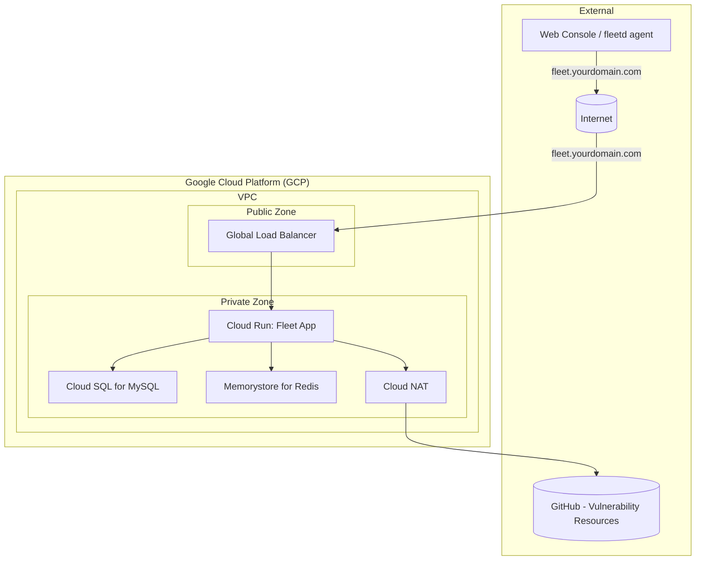

<!-- BEGIN_TF_DOCS -->
# Terraform Google Cloud Fleet Deployment

This Terraform project automates the deployment of Fleet Device Management (Fleet) on the Google Cloud Platform (GCP). By default it creates a new GCP project and deploys all necessary infrastructure components. To use an existing project instead, set `create_project = false` and provide a `project_id`.

## How to apply

**Run Terraform from this directory only** — the same place as `main.tf`, `variables.tf`, and `terraform.tfvars`.

```bash
terraform init
terraform plan
terraform apply
```

`byo-project/` is a **local module** (`source = "./byo-project"` in `main.tf`), not a separate root module. Do not `cd byo-project` and apply there — that layout does not work as a standalone stack with our wiring (root holds backend, provider, tfvars, and project selection).

It deploys:

*   A new GCP project (via `terraform-google-modules/project-factory`)
*   VPC Network and Subnets
*   Cloud NAT for outbound internet access
*   Cloud SQL for MySQL (database for Fleet)
*   Memorystore for Redis (caching for Fleet)
*   Google Cloud Storage (GCS) bucket (for Fleet software installers, S3-compatible access configured)
*   Google Secret Manager (for storing sensitive data like database passwords and Fleet server private key)
*   Cloud Run v2 Service (for the main Fleet application)
*   Cloud Run v2 Job (for database migrations)
*   External HTTP(S) Load Balancer with managed SSL certificate
*   Cloud DNS for managing the Fleet endpoint
*   Appropriate IAM service accounts and permissions

## Prerequisites

1.  **Terraform:** Version `~> 1.11` (as specified in `main.tf`).
2.  **Google Cloud SDK (`gcloud`):** Installed and configured. Install from [cloud.google.com/sdk](https://cloud.google.com/sdk/docs/install).
3.  **GCP Account & Permissions:**
    *   Credentials configured for Terraform to interact with GCP. Run `gcloud auth application-default login`.
    *   **New project** (`create_project = true`, the default): `Organization Administrator` or `Folder Creator` & `Project Creator` at the org/folder level, plus `Billing Account User` on the billing account.
    *   **Existing project** (`create_project = false`): `Owner` or `Editor` on the target project, plus `roles/dns.admin` if managing Cloud DNS.
4.  **Registered Domain Name:** You will need a domain name that you can manage DNS records for. This project will create a Cloud DNS Managed Zone for this domain (or a subdomain).
5.  **(Optional) Fleet License Key:** If you have a premium Fleet license, you can provide it via `fleet_config.license_key`.

### APIs in an existing project

New projects automatically enable the Fleet baseline APIs. For `create_project = false`, API management remains **off by default**. Either pre-enable the baseline listed in [`api-management.tf`](./api-management.tf), plus any APIs your optional configuration needs, or opt in:

```hcl
create_project               = false
project_id                   = "your-existing-project-id"
manage_existing_project_apis = true
extra_apis                   = [] # additional APIs beyond the Fleet baseline
```

With this opt-in, Terraform enables the same baseline as new projects plus `extra_apis`, and waits for those APIs before creating Fleet resources. The Terraform identity needs permission to enable services, such as `roles/serviceusage.serviceUsageAdmin`. Opting out later or destroying the stack **does not disable these APIs**. Without the opt-in, `extra_apis` does not manage APIs in an existing project; some child resources still enable their individual APIs (Redis and, when requested, KMS). Direct callers of `byo-project` must manage the remaining prerequisites themselves.

## Configuration

1.  **Create a `terraform.tfvars` file** with at minimum:

    ```hcl
    billing_account_id = "012345-6789AB-CDEFGH"
    org_id             = "111122223333"  # or use folder_id instead
    dns_zone_name      = "gcp.example.com."
    dns_record_name    = "fleet.gcp.example.com."

    fleet_config = {
      image_tag              = "fleetdm/fleet:v4.93.0"
      fleet_cpu              = "1000m"
      fleet_memory           = "4096Mi"
      debug_logging          = false
      min_instance_count     = 1
      max_instance_count     = 5
      exec_migration         = true
      use_h2c                = false
      installers_bucket_name = "your-globally-unique-bucket-name"
      # license_key           = ""
    }
    ```

    To use an existing project instead, omit `billing_account_id` and `org_id` and set:
    ```hcl
    create_project = false
    project_id     = "your-existing-project-id"
    ```

2.  **Required variables** (no defaults — must be set):

    | Variable | Description |
    |---|---|
    | `billing_account_id` | GCP Billing Account ID. Required when `create_project = true` (the default). |
    | `org_id` or `folder_id` | Where to create the project. Required when `create_project = true`. |
    | `dns_zone_name` | DNS zone managed in Cloud DNS (e.g., `gcp.example.com.`). **Must end with a dot.** |
    | `dns_record_name` | FQDN for Fleet (e.g., `fleet.gcp.example.com.`). **Must end with a dot.** |
    | `fleet_config.installers_bucket_name` | GCS bucket name for software installers. Must be globally unique. |

    When `create_project = false`, set `project_id` instead of `billing_account_id` and `org_id`/`folder_id`.

    Review `variables.tf` and `byo-project/variables.tf` for all available options and their defaults.

## Cloud Armor allowlist (optional)

`cloud_armor` attaches an optional Cloud Armor security policy to the load balancer. It is **off by default** (`cloud_armor.enable = false`), and when it is off nothing is created.

When enabled, the policy is an explicit allowlist that you own:

| Input | Effect |
|---|---|
| `allowed_ip_ranges` | Requests from these source IP ranges (CIDRs) are allowed to **any path**. |
| `allow_public_paths` | Requests whose path matches one of these RE2 regular expressions are allowed from **any source**. |
| everything else | Denied with **HTTP 403**. |

* **No Fleet endpoints are allowed automatically.** The module never adds default paths or IP ranges. You decide what is reachable.
* Either list may be empty. An IP-only policy (only `allowed_ip_ranges`) is valid. Enabling the policy with **both** lists empty is rejected at plan time, because it would return 403 for every request.
* **IP-only policies block devices outside those ranges.** With no `allow_public_paths`, fleetd/osquery agents and MDM-enrolled devices can reach Fleet only if their traffic comes from a listed range (for example, a VPN or office egress). Devices anywhere else get 403, so enrollment, check-ins, and MDM commands fail for them.
* `allow_public_paths` entries are RE2 regexes matched against the request path. Anchor them with `^` so they only match the intended path prefix. Each regex is passed to Cloud Armor as an escaped CEL string literal, so quotes and backslashes are safe and keep their regex meaning. In HCL, write a regex backslash as `\\` (for example, `"^/api/v\\d+/"`).
* Rules are chunked to fit Cloud Armor limits: up to 5 path regexes per rule (priorities 1000, 1010, …) and up to 10 IP ranges per rule (priorities 2000, 2010, …). The deny-all rule is the policy's default rule at priority 2147483647.
* Only `tier = "STANDARD"` is implemented. `tier = "ENTERPRISE"` is rejected when the policy is enabled.

### Choosing public paths

Which paths your devices need depends on the Fleet features you use (osquery/fleetd, Fleet Desktop, Apple/Windows/Android MDM, and so on). Use Fleet's guide [What API endpoints to expose to the public internet?](https://fleetdm.com/guides/what-api-endpoints-to-expose-to-the-public-internet) as a feature-by-feature starting point. Treat it as a reference, not an exhaustive or version-locked list, and confirm the paths against the Fleet version you run:

* Paths in the guide can differ from Fleet's server routes. For example, Fleet serves its ACME endpoints under `/api/mdm/acme/{identifier}/...`. A pattern for that route is `^/api/mdm/acme/[^/]+/`.
* fleetd's update (TUF) repository is normally not served by this load balancer. By default, fleetd downloads updates from `updates.fleetdm.com` (or from your own TUF server), so TUF paths usually do not belong in this list.

After enabling, check the load balancer logs for 403 responses from managed devices and adjust the list.

### Requirements and limitations

* **Regional load balancer only.** Cloud Armor is currently wired only for the regional external Application Load Balancer. `cloud_armor.enable = true` requires `load_balancer_config.enable = true` and `load_balancer_config.use_regional_lb = true`. The global load balancer path is not supported.
* **Native Terraform attachment.** The regional backend uses `google-beta`'s `security_policy` field. Attachment, detachment, and drift are tracked by Terraform; no `gcloud` command or separate CLI login is required. The policy's allow/deny rules are configured before attachment.
* **Upgrade before disabling an older draft policy.** If an existing deployment used the previous `null_resource`/`gcloud` attachment, first apply this version with Cloud Armor still enabled and its configuration unchanged. That records the native attachment and detach-before-delete ordering in state. Only on a subsequent apply should you disable Cloud Armor or destroy the deployment. The old provisioner is forgotten without running its detach command; skipping this intermediate upgrade can leave GCP refusing to delete a still-attached policy.

### Examples

IP-only: admins and devices must all come from the listed ranges.

```hcl
load_balancer_config = {
  use_regional_lb = true
}

cloud_armor = {
  enable            = true
  allowed_ip_ranges = ["203.0.113.0/24", "198.51.100.7/32"]
}
```

Admin IP ranges plus explicit public device paths:

```hcl
load_balancer_config = {
  use_regional_lb = true
}

cloud_armor = {
  enable            = true
  allowed_ip_ranges = ["203.0.113.0/24"] # any path from these sources

  # Illustrative, not complete: build this list from the Fleet guide above
  # for the features you use, and verify it against your Fleet version.
  allow_public_paths = [
    "^/api/(v1/)?osquery/",
    "^/api/fleet/orbit/",
    "^/api/mdm/acme/[^/]+/",
  ]
}
```

## Customer-managed encryption (CMEK)

CMEK uses Google Cloud KMS keys for encryption at rest, analogous to AWS KMS customer-managed keys. All new service options below are **unset/off by default**, independently of the existing GCS setting. Setting `cmek.enable = true` still enables **GCS-only** encryption; it does not opt existing databases, caches, services, or secrets into new encryption changes.

| Configuration | Scope | Required key location | Existing-resource consequence |
|---|---|---|---|
| `enable`, `create_kms`, `kms_key_ring`, `kms_crypto_key` | Existing GCS bucket encryption configuration; optionally creates its key | `location`, matching the bucket | Existing objects are not retroactively re-encrypted |
| `cloud_sql.kms_key_id` | Cloud SQL instance | `region` | **Instance replacement**; migrate/back up data before enabling |
| `redis.kms_key_id` | Memorystore Redis instance | `region` | **Instance replacement** |
| `cloud_run.kms_key_id` | Fleet service and migration job | `region` | Service revision/job template update |
| `secret_manager.kms_key_id` | Managed secrets with automatic replication | `global` | **Managed secret replacement** with the same IDs under the pinned provider |
| `secret_manager.replica_kms_key_ids` | Managed secrets with `replicate_secrets` set | One key in each replica's region | **Managed secret replacement** with the same IDs under the pinned provider |

The new consumers accept **full key IDs** for keys provisioned separately or by the caller's Terraform configuration; they do not create additional keys. The deployer must be allowed to grant key access to each service's Google-managed service agent. API enablement is a prerequisite, particularly for existing projects; use the opt-in above or pre-enable the required services. A regional key cannot be replaced by the default multi-region GCS key, and a global Secret Manager key cannot be used for a regional service.

For example, for an encrypted fresh provision using existing keys and regional secret replication:

```hcl
region            = "us-central1"
replicate_secrets = ["us-central1"]

cmek = {
  # GCS remains separately opt-in through enable/kms_key_ring/kms_crypto_key.
  cloud_sql = {
    kms_key_id = "projects/YOUR_PROJECT_ID/locations/us-central1/keyRings/fleet/cryptoKeys/database"
  }
  redis = {
    kms_key_id = "projects/YOUR_PROJECT_ID/locations/us-central1/keyRings/fleet/cryptoKeys/cache"
  }
  cloud_run = {
    kms_key_id = "projects/YOUR_PROJECT_ID/locations/us-central1/keyRings/fleet/cryptoKeys/run"
  }
  secret_manager = {
    replica_kms_key_ids = {
      us-central1 = "projects/YOUR_PROJECT_ID/locations/us-central1/keyRings/fleet/cryptoKeys/secrets"
    }
  }
}
```

With automatic replication (`replicate_secrets = []`), use `secret_manager = { kms_key_id = "projects/YOUR_PROJECT_ID/locations/global/keyRings/fleet/cryptoKeys/secrets" }` instead. Regional replication requires a key for every configured replica; the module does not silently leave any managed replica unencrypted. External private-key secrets and `extra_secret_env_vars` remain caller-managed and are not modified by this configuration.

**Review the plan before upgrading.** Opting an existing SQL or Redis instance into CMEK is not a safe in-place migration. Changing managed-secret replication encryption replaces those secrets under the pinned provider and recreates current values from Terraform; historical versions are not preserved by that replacement. Back up required versions before making this change. These settings do not enable database/Redis TLS, create an Artifact Registry repository, certify compliance, or bypass organization policies. The Cloud Run invoker still uses an `allUsers` IAM member, which restrictive domain policies may reject. Use a compatible image supplied through `fleet_config.image_tag`; validate the image and encryption configuration in your target GCP environment.

## Installer-bucket versioning and retention

Versioning is optional and **off by default**, matching the AWS Terraform modules. The existing bucket name remains `fleet_config.installers_bucket_name`.

```hcl
software_installers_config = {
  enable_bucket_versioning           = true
  expire_noncurrent_versions         = true # opt out with false
  noncurrent_version_expiration_days = 30
}
```

When versioning is enabled, noncurrent-version expiry defaults on after 30 days. The lifecycle targets **archived/noncurrent versions only**, never the live installer object. Disable expiry to retain all versions indefinitely. With versioning off, this module adds no expiry rule. Enabling expiry on an existing versioned bucket can delete versions already older than the configured window; `allow_destroy` does not prevent lifecycle expiry. Applying the new default to a previously versioned draft deployment suspends versioning without deleting its retained versions.

## Upgrade notes

* Legacy project creation remains the default. Keep `create_project = true` for projects managed by this module; do not switch to the existing-project path as a shortcut, because removing project-factory ownership can affect the project and its services.
* The database default remains `fleet-mysql`. If a draft deployment was created with `fleet-mysql-v2`, explicitly retain that name in `database_config` before upgrading, or Terraform will propose replacement.
* The regional load balancer now shares one reserved IP for HTTP and HTTPS, including when `create_static_ip = false`. Previously ephemeral draft deployments may change IP; update external DNS and review the plan.
* Duplicate regional invoker ownership and the unused packages mirror are forgotten without remote deletion. New deployments no longer create the mirror. Operators retaining an old mirror must manage it separately.
* `backend_timeout_sec` is an unsupported legacy input: serverless NEG backends do not accept a configurable backend timeout. The Fleet Cloud Run service timeout remains 300 seconds; this input does not change it.

## Known Limitations

1. To handle large uploads, we need to bypass GCP Cloud Run's 32MB HTTP/1 body limit by setting `fleet_config.use_h2c = true`, which forces Fleet to use HTTP/2. However, as Cloud Run documentation notes, HTTP/2 end-to-end breaks connection upgrades, affecting WebSocket support and Fleet functionality for features such as Live Queries.

    **Workaround**: [Use Fleet GitOps Flow](https://fleetdm.com/docs/using-fleet/gitops#managing-software-installers)
    * Set `fleet_config.use_h2c = false` to force HTTP/1.
    * If you have large uploads, use `fleetctl apply` with a `url` field in your software YAML. The data flow avoids the ingress limit:
        * Apply the YAML (small request).
        * The Fleet Server makes an outbound GET request to download the file from the URL (S3, GCS, etc).
        * Cloud Run doesn't apply the 32MB limit to outbound requests.

## Deployment Steps

All commands below are run from this directory, not from `byo-project/`.

1.  **Authenticate with GCP:**
    ```bash
    gcloud auth application-default login
    ```

2.  **Initialize:**
    ```bash
    terraform init
    ```

3.  **Plan the Deployment:**
    ```bash
    terraform plan
    ```

4.  **Apply the Configuration:**
    ```bash
    terraform apply
    ```
    Initial provisioning can take 10–20 minutes, primarily due to Cloud SQL instance creation and API enablement.

5.  **Update DNS (if not using Cloud DNS for the parent zone):**
    If `dns_zone_name` (e.g., `gcp.example.com.`) is a new zone created by this Terraform, and your parent domain (e.g., `example.com.`) is managed elsewhere (e.g., GoDaddy, Cloudflare), you need to delegate this new zone.
    *   Get the Name Servers (NS) records for the newly created `google_dns_managed_zone`:
        ```bash
        terraform output dns_managed_zone_name_servers
        ```
    *   Add these NS records to your parent domain's DNS settings at your registrar or DNS provider.

    **If you disabled Cloud DNS (`dns_config.enable = false`):** Manually create an A record in your DNS provider pointing to the load balancer IP output by `terraform output load_balancer_ip_address`.

## Accessing Fleet

Once the deployment is complete, migrations have run successfully, and DNS has propagated:

*   Navigate to the `dns_record_name` you configured (e.g., `https://fleet.gcp.example.com`).
*   You should be greeted by the Fleet setup page or login screen.

## Key Resources Created (within the `byo-project` module)

*   **VPC Network (`fleet-network`):** Custom network for Fleet resources.
*   **Subnet (`fleet-subnet`):** Subnetwork within the VPC.
*   **Cloud Router & NAT:** For outbound internet access from Cloud Run and other private resources.
*   **Cloud SQL for MySQL (`fleet-mysql`):** Managed MySQL database.
*   **Memorystore for Redis (`fleet-cache`):** Managed Redis instance.
*   **GCS Bucket:** For S3-compatible software installer storage.
*   **Secret Manager Secrets:** Database password, Fleet server private key, and HMAC key for GCS access.
*   **Service Account (`fleet-run-sa`):** Used by Cloud Run services/jobs with necessary permissions.
*   **Cloud Run Service:** Hosts the main Fleet application.
*   **Cloud Run Job:** Runs database migrations.
*   **External HTTP(S) Load Balancer:** Provides public HTTPS access to Fleet.
*   **Cloud DNS Managed Zone:** Manages DNS records for `dns_zone_name`.
*   **DNS A Record:** Points `dns_record_name` to the load balancer IP.

## Cleaning Up

To destroy all resources:

```bash
allow_destroy = true   # set in terraform.tfvars first
terraform apply        # apply the protection removal
terraform destroy      # then destroy
```

Setting `allow_destroy = true` disables Cloud SQL's Terraform deletion protection and allows deletion of objects in non-empty GCS buckets during destroy. Apply that change before destroying. It does not control KMS protection: key rings/key names remain reserved by GCP, and managed key versions have a destruction window (30 days by default). With `allow_destroy = false`, an unprotected database or an empty bucket may still be destroyed; this is not a universal destroy guard.

## Important Considerations

*   **Permissions:** The user or service account running Terraform needs extensive permissions, especially for project creation. For ongoing management within the project, `Project Editor` or more granular roles generally suffice.
*   **Fleet Configuration:** This Terraform setup provisions the infrastructure. Further Fleet application configuration (e.g., SSO, SMTP, agent options) is done through the Fleet UI or API after deployment.
*   **Security:**
    *   Review IAM permissions granted.
    *   With the default managed certificate and `https_redirect = true`, the load balancer provides HTTPS and redirects HTTP. Disabling the regional managed certificate also requires disabling HTTPS redirects; that configuration is HTTP-only.
    *   Cloud SQL and Memorystore are not publicly accessible and connect via Private Service Access.
*   **Scalability:** Cloud Run scaling (`min_instance_count`, `max_instance_count`) and database/cache tier can be adjusted via `fleet_config`, `database_config`, and `cache_config`.

### Networking Diagram

```mermaid
graph TD
    subgraph External
        Internet[(Internet)]
        Users[Web Console / fleetd agent]
        GitHub[(GitHub - Vulnerability Resources)]
    end

    subgraph "Google Cloud Platform (GCP)"
        subgraph VPC [VPC]
            direction LR
            subgraph PublicFacing [Public Zone]
                LB[Global Load Balancer]
            end
            subgraph PrivateZone [Private Zone]
                CloudRun[Cloud Run: Fleet App]
                CloudSQL[Cloud SQL for MySQL]
                Redis[Memorystore for Redis]
                NAT[Cloud NAT]
            end

            CloudRun --> Redis
            CloudRun --> CloudSQL
            CloudRun --> NAT
        end
    end

    Users -- "fleet.yourdomain.com" --> Internet
    Internet -- "fleet.yourdomain.com" --> LB
    LB --> CloudRun
    NAT --> GitHub

```

## Requirements

| Name | Version |
| ---- | ------- |
| <a name="requirement_terraform"></a> [terraform](#requirement\_terraform) | ~> 1.11 |
| <a name="requirement_google"></a> [google](#requirement\_google) | >= 6.35.0 |
| <a name="requirement_google-beta"></a> [google-beta](#requirement\_google-beta) | >= 6.35.0 |

## Providers

| Name | Version |
| ---- | ------- |
| <a name="provider_google"></a> [google](#provider\_google) | >= 6.35.0 |

## Modules

| Name | Source | Version |
| ---- | ------ | ------- |
| <a name="module_fleet"></a> [fleet](#module\_fleet) | ./byo-project | n/a |
| <a name="module_project_factory"></a> [project\_factory](#module\_project\_factory) | terraform-google-modules/project-factory/google | ~> 18.0.0 |

## Resources

| Name | Type |
| ---- | ---- |
| [google_project_service.existing_project_apis](https://registry.terraform.io/providers/hashicorp/google/latest/docs/resources/project_service) | resource |

## Inputs

| Name | Description | Type | Default | Required |
| ---- | ----------- | ---- | ------- | :------: |
| <a name="input_allow_destroy"></a> [allow\_destroy](#input\_allow\_destroy) | When true, permits teardown of protected Cloud SQL and non-empty GCS buckets:<br/>  - Cloud SQL: deletion\_protection = false<br/>  - GCS buckets: force\_destroy = true (deletes objects when destroying a bucket)<br/><br/>This does not control KMS key protection or GCP's key-version destruction window.<br/><br/>Keep false in production. Set true only when tearing down the environment.<br/>When allow\_destroy overrides database\_config.deletion\_protection, the more<br/>permissive value (false) wins. | `bool` | `false` | no |
| <a name="input_billing_account_id"></a> [billing\_account\_id](#input\_billing\_account\_id) | GCP Billing Account ID (required when create\_project=true) | `string` | `null` | no |
| <a name="input_cache_config"></a> [cache\_config](#input\_cache\_config) | Configuration for the Memorystore (Redis) instance. | <pre>object({<br/>    name           = string<br/>    tier           = string<br/>    engine_version = string<br/>    connect_mode   = string<br/>    memory_size    = number<br/>  })</pre> | <pre>{<br/>  "connect_mode": "PRIVATE_SERVICE_ACCESS",<br/>  "engine_version": null,<br/>  "memory_size": 1,<br/>  "name": "fleet-cache",<br/>  "tier": "STANDARD_HA"<br/>}</pre> | no |
| <a name="input_cloud_armor"></a> [cloud\_armor](#input\_cloud\_armor) | Optional Cloud Armor allowlist for the regional load balancer (off by default).<br/>When enable = true the policy allows requests from any source in allowed\_ip\_ranges (any path),<br/>and requests to any path matching an RE2 regex in allow\_public\_paths (any source).<br/>All other requests are denied with HTTP 403. No Fleet endpoints are allowed automatically;<br/>at least one of allowed\_ip\_ranges or allow\_public\_paths must be non-empty when enabled.<br/>Requires load\_balancer\_config.enable = true and use\_regional\_lb = true.<br/>Attachment is managed natively with google-beta; no gcloud CLI is required.<br/>Only tier = STANDARD is implemented; the legacy tier field is retained for compatibility. | <pre>object({<br/>    enable             = optional(bool, false)<br/>    tier               = optional(string, "STANDARD")<br/>    allowed_ip_ranges  = optional(list(string), [])<br/>    allow_public_paths = optional(list(string), [])<br/>  })</pre> | <pre>{<br/>  "allow_public_paths": [],<br/>  "allowed_ip_ranges": [],<br/>  "enable": false,<br/>  "tier": "STANDARD"<br/>}</pre> | no |
| <a name="input_cmek"></a> [cmek](#input\_cmek) | Customer-Managed Encryption Key configuration. When enable = true, the GCS<br/>buckets are encrypted with the crypto key at local.kms\_crypto\_key\_id<br/>(located at var.location).<br/><br/>When create\_kms = true, Terraform creates the key ring and crypto key in the<br/>target project/region using the provided names. When false, they must already<br/>exist. These legacy settings only ever encrypt the GCS buckets.<br/><br/>Optional, independent opt-ins (default null = Google-managed, unchanged):<br/>  cloud\_sql      = { kms\_key\_id = "<full key ID in var.region>" }<br/>  redis          = { kms\_key\_id = "<full key ID in var.region>" }<br/>  cloud\_run      = { kms\_key\_id = "<full key ID in var.region>" }<br/>  secret\_manager = {<br/>    kms\_key\_id          = "<global key ID>"       # automatic replication<br/>    replica\_kms\_key\_ids = { "<region>" = "<key>" } # one per replicate\_secrets region<br/>  }<br/>Keys are never created for these; callers supply existing keys (or keys<br/>managed elsewhere in their configuration). Terraform grants the Cloud SQL,<br/>Memorystore, Cloud Run and Secret Manager service agents<br/>roles/cloudkms.cryptoKeyEncrypterDecrypter on them. Enabling cloud\_sql or<br/>redis on an existing deployment replaces the instance; enabling<br/>secret\_manager replaces the Fleet-managed secrets. | <pre>object({<br/>    enable         = optional(bool, false)<br/>    create_kms     = optional(bool, false)<br/>    kms_key_ring   = optional(string)<br/>    kms_crypto_key = optional(string)<br/>    cloud_sql = optional(object({<br/>      kms_key_id = string<br/>    }))<br/>    redis = optional(object({<br/>      kms_key_id = string<br/>    }))<br/>    cloud_run = optional(object({<br/>      kms_key_id = string<br/>    }))<br/>    secret_manager = optional(object({<br/>      kms_key_id          = optional(string)<br/>      replica_kms_key_ids = optional(map(string), {})<br/>    }))<br/>  })</pre> | <pre>{<br/>  "create_kms": false,<br/>  "enable": false,<br/>  "kms_crypto_key": null,<br/>  "kms_key_ring": null<br/>}</pre> | no |
| <a name="input_create_project"></a> [create\_project](#input\_create\_project) | Whether to create a new GCP project (true) or use an existing one (false). When true, org\_id or folder\_id must be set, plus billing\_account\_id; folder\_id takes precedence when both are provided. | `bool` | `true` | no |
| <a name="input_database_config"></a> [database\_config](#input\_database\_config) | Configuration for the Cloud SQL (MySQL) instance. | <pre>object({<br/>    name                = string<br/>    database_name       = string<br/>    database_user       = string<br/>    collation           = string<br/>    charset             = string<br/>    deletion_protection = bool<br/>    database_version    = string<br/>    tier                = string<br/>  })</pre> | <pre>{<br/>  "charset": "utf8mb4",<br/>  "collation": "utf8mb4_unicode_ci",<br/>  "database_name": "fleet",<br/>  "database_user": "fleet",<br/>  "database_version": "MYSQL_8_0",<br/>  "deletion_protection": false,<br/>  "name": "fleet-mysql",<br/>  "tier": "db-n1-standard-1"<br/>}</pre> | no |
| <a name="input_dns_config"></a> [dns\_config](#input\_dns\_config) | DNS configuration. Set enable=false when using external DNS providers or when Cloud DNS is unavailable. | <pre>object({<br/>    enable = bool<br/>  })</pre> | <pre>{<br/>  "enable": true<br/>}</pre> | no |
| <a name="input_dns_record_name"></a> [dns\_record\_name](#input\_dns\_record\_name) | The DNS record for Fleet (e.g., 'fleet.my-fleet-infra.com.') | `string` | n/a | yes |
| <a name="input_dns_zone_name"></a> [dns\_zone\_name](#input\_dns\_zone\_name) | The DNS name of the managed zone (e.g., 'my-fleet-infra.com.') | `string` | n/a | yes |
| <a name="input_extra_apis"></a> [extra\_apis](#input\_extra\_apis) | Additional GCP APIs merged with the Fleet baseline when create\_project = true, or when manage\_existing\_project\_apis = true on an existing project. Otherwise existing-project API enablement remains operator-managed. | `list(string)` | `[]` | no |
| <a name="input_fleet_config"></a> [fleet\_config](#input\_fleet\_config) | Configuration for the Fleet application deployment. | <pre>object({<br/>    image_tag                       = string<br/>    fleet_cpu                       = string<br/>    fleet_memory                    = string<br/>    debug_logging                   = bool<br/>    license_key                     = optional(string)<br/>    fleet_server_private_key        = optional(string) # Plaintext (dev/test only). If null and `fleet_server_private_key_secret` is null, a 32-char key is auto-generated.<br/>    fleet_server_private_key_secret = optional(string) # Short secret_id of an existing Secret Manager secret in the same project. Takes precedence over plaintext.<br/>    min_instance_count              = number<br/>    max_instance_count              = number<br/>    exec_migration                  = bool<br/>    use_h2c                         = bool<br/>    extra_env_vars                  = optional(map(string))<br/>    extra_secret_env_vars = optional(map(object({<br/>      secret  = string<br/>      version = string<br/>    })))<br/>    installers_bucket_name = optional(string)<br/>  })</pre> | <pre>{<br/>  "debug_logging": false,<br/>  "exec_migration": true,<br/>  "extra_env_vars": {},<br/>  "extra_secret_env_vars": {},<br/>  "fleet_cpu": "1000m",<br/>  "fleet_memory": "4096Mi",<br/>  "image_tag": "fleetdm/fleet:v4.93.0",<br/>  "installers_bucket_name": "",<br/>  "max_instance_count": 5,<br/>  "min_instance_count": 1,<br/>  "use_h2c": false<br/>}</pre> | no |
| <a name="input_fleet_image"></a> [fleet\_image](#input\_fleet\_image) | Legacy no-op input retained for compatibility. Use fleet\_config.image\_tag to select the Fleet image. | `string` | `"v4.67.3"` | no |
| <a name="input_folder_id"></a> [folder\_id](#input\_folder\_id) | GCP Folder ID (numeric, without the 'folders/' prefix). When set with create\_project=true, the new project is created under this folder instead of directly under the organization. Ignored when create\_project=false. | `string` | `null` | no |
| <a name="input_labels"></a> [labels](#input\_labels) | Resource labels to apply to all resources | `map(string)` | <pre>{<br/>  "application": "fleet"<br/>}</pre> | no |
| <a name="input_load_balancer_config"></a> [load\_balancer\_config](#input\_load\_balancer\_config) | Load balancer configuration | <pre>object({<br/>    enable              = optional(bool, true)<br/>    use_regional_lb     = optional(bool, false)<br/>    https_redirect      = optional(bool, true)<br/>    create_managed_cert = optional(bool, true)<br/>    create_static_ip    = optional(bool, false)<br/>    backend_timeout_sec = optional(number, 30)<br/>    log_sample_rate     = optional(number, 1.0)<br/>    proxy_subnet_cidr   = optional(string, "10.129.0.0/23")<br/>  })</pre> | <pre>{<br/>  "backend_timeout_sec": 30,<br/>  "create_managed_cert": true,<br/>  "create_static_ip": false,<br/>  "enable": true,<br/>  "https_redirect": true,<br/>  "log_sample_rate": 1,<br/>  "proxy_subnet_cidr": "10.129.0.0/23",<br/>  "use_regional_lb": false<br/>}</pre> | no |
| <a name="input_location"></a> [location](#input\_location) | Defaults to "us" (multi-region) — the higher-availability choice suitable<br/>for most deployments. Override with a specific region string if you have<br/>data-residency or compliance requirements that need single-region placement.<br/><br/>GCS bucket location and KMS key location must match for CMEK to work, so<br/>both are driven off this single variable.<br/><br/>Compute/network/DB resources (Cloud Run, Cloud SQL, Memorystore, VPC,<br/>LB) always use `region`. | `string` | `"us"` | no |
| <a name="input_manage_existing_project_apis"></a> [manage\_existing\_project\_apis](#input\_manage\_existing\_project\_apis) | Opt in to enabling the baseline Fleet APIs plus extra\_apis on an existing project (create\_project = false). APIs are never disabled on destroy. Has no effect when create\_project = true; the project factory already enables these APIs. | `bool` | `false` | no |
| <a name="input_org_id"></a> [org\_id](#input\_org\_id) | GCP Organization ID. Required when create\_project=true and folder\_id is not set. Ignored when create\_project=false. | `string` | `null` | no |
| <a name="input_prefix"></a> [prefix](#input\_prefix) | Legacy no-op input retained for compatibility. The child module uses its own prefix default. | `string` | `"fleet"` | no |
| <a name="input_project_id"></a> [project\_id](#input\_project\_id) | GCP project ID where Fleet will be deployed. Required when create\_project=false. Ignored when create\_project=true (the factory generates one). | `string` | `null` | no |
| <a name="input_project_name"></a> [project\_name](#input\_project\_name) | Name for the new GCP project | `string` | `"fleet"` | no |
| <a name="input_random_project_id"></a> [random\_project\_id](#input\_random\_project\_id) | Whether to append a random suffix to project name | `bool` | `true` | no |
| <a name="input_region"></a> [region](#input\_region) | GCP region for regional-only resources (Cloud Run, Cloud SQL, Memorystore, VPC, LB, Certificate Manager). | `string` | `"us-central1"` | no |
| <a name="input_replicate_secrets"></a> [replicate\_secrets](#input\_replicate\_secrets) | Regions to pin Secret Manager replication to (applies to fleet-managed<br/>secrets: DB password, Fleet server private key, HMAC secret).<br/><br/>Empty (default) uses `automatic` replication — Google chooses locations,<br/>fewest constraints, works everywhere. Non-empty switches to<br/>`user_managed` replication with one replica per region.<br/><br/>Provide at least two regions if you want cross-region redundancy under<br/>user\_managed (single-region user\_managed has no failover).<br/><br/>NOTE: switching an existing secret between automatic and user\_managed<br/>forces replacement (destroy + recreate). | `list(string)` | `[]` | no |
| <a name="input_software_installers_config"></a> [software\_installers\_config](#input\_software\_installers\_config) | Object versioning and noncurrent-version retention for the software<br/>installers bucket (fleet\_config.installers\_bucket\_name). Matches the AWS<br/>module defaults:<br/><br/>  enable\_bucket\_versioning           - Turn on GCS object versioning<br/>                                       (default false).<br/>  expire\_noncurrent\_versions         - When versioning is on, delete<br/>                                       noncurrent (overwritten or deleted)<br/>                                       object versions after<br/>                                       noncurrent\_version\_expiration\_days<br/>                                       (default true). Set false to keep<br/>                                       every noncurrent version.<br/>  noncurrent\_version\_expiration\_days - Days a version must have been<br/>                                       noncurrent before it is deleted<br/>                                       (default 30). Must be a positive<br/>                                       whole number.<br/><br/>The expiry rule only matches noncurrent versions; live objects are never<br/>deleted by it. With versioning off no lifecycle rule is created. Turning<br/>versioning off on an existing versioned bucket suspends versioning but<br/>does not delete versions already stored. | <pre>object({<br/>    enable_bucket_versioning           = optional(bool, false)<br/>    expire_noncurrent_versions         = optional(bool, true)<br/>    noncurrent_version_expiration_days = optional(number, 30)<br/>  })</pre> | `{}` | no |
| <a name="input_vpc_config"></a> [vpc\_config](#input\_vpc\_config) | Configuration for the VPC network and subnets. | <pre>object({<br/>    network_name = string<br/>    subnets = list(object({<br/>      subnet_name           = string<br/>      subnet_ip             = string<br/>      subnet_region         = string<br/>      subnet_private_access = bool<br/>    }))<br/>  })</pre> | <pre>{<br/>  "network_name": "fleet-network",<br/>  "subnets": [<br/>    {<br/>      "subnet_ip": "10.10.10.0/24",<br/>      "subnet_name": "fleet-subnet",<br/>      "subnet_private_access": true,<br/>      "subnet_region": "us-central1"<br/>    }<br/>  ]<br/>}</pre> | no |

## Outputs

| Name | Description |
| ---- | ----------- |
| <a name="output_cloud_router_name"></a> [cloud\_router\_name](#output\_cloud\_router\_name) | The name of the Cloud Router created for NAT. |
| <a name="output_cloud_run_service_location"></a> [cloud\_run\_service\_location](#output\_cloud\_run\_service\_location) | The location of the deployed Fleet Cloud Run service. |
| <a name="output_cloud_run_service_name"></a> [cloud\_run\_service\_name](#output\_cloud\_run\_service\_name) | The name of the deployed Fleet Cloud Run service. |
| <a name="output_dns_managed_zone_name"></a> [dns\_managed\_zone\_name](#output\_dns\_managed\_zone\_name) | The name of the Cloud DNS managed zone created for Fleet. |
| <a name="output_dns_managed_zone_name_servers"></a> [dns\_managed\_zone\_name\_servers](#output\_dns\_managed\_zone\_name\_servers) | The authoritative name servers for the created Cloud DNS managed zone. Delegate your domain to these. |
| <a name="output_fleet_application_url"></a> [fleet\_application\_url](#output\_fleet\_application\_url) | The primary URL to access the Fleet application (via the Load Balancer). |
| <a name="output_fleet_service_account_email"></a> [fleet\_service\_account\_email](#output\_fleet\_service\_account\_email) | The email address of the service account used by the Fleet Cloud Run service. |
| <a name="output_load_balancer_ip_address"></a> [load\_balancer\_ip\_address](#output\_load\_balancer\_ip\_address) | The external IP address of the HTTP(S) Load Balancer. |
| <a name="output_load_balancer_type"></a> [load\_balancer\_type](#output\_load\_balancer\_type) | The type of load balancer deployed (global, regional, or none). |
| <a name="output_mysql_instance_connection_name"></a> [mysql\_instance\_connection\_name](#output\_mysql\_instance\_connection\_name) | The connection name for the Cloud SQL instance (used by Cloud SQL Proxy). |
| <a name="output_mysql_instance_name"></a> [mysql\_instance\_name](#output\_mysql\_instance\_name) | The name of the Cloud SQL for MySQL instance. |
| <a name="output_redis_host"></a> [redis\_host](#output\_redis\_host) | The host IP address of the Memorystore for Redis instance. |
| <a name="output_redis_instance_name"></a> [redis\_instance\_name](#output\_redis\_instance\_name) | The name of the Memorystore for Redis instance. |
| <a name="output_redis_port"></a> [redis\_port](#output\_redis\_port) | The port number of the Memorystore for Redis instance. |
| <a name="output_regional_cert_dns_authorization_record"></a> [regional\_cert\_dns\_authorization\_record](#output\_regional\_cert\_dns\_authorization\_record) | CNAME record to publish at your external DNS provider when using a regional managed certificate with dns\_config.enable = false. |
| <a name="output_software_installers_bucket_name"></a> [software\_installers\_bucket\_name](#output\_software\_installers\_bucket\_name) | The name of the GCS bucket for Fleet software installers. |
| <a name="output_software_installers_bucket_url"></a> [software\_installers\_bucket\_url](#output\_software\_installers\_bucket\_url) | The gsutil URL of the GCS bucket for Fleet software installers. |
| <a name="output_vpc_network_name"></a> [vpc\_network\_name](#output\_vpc\_network\_name) | The name of the VPC network created. |
| <a name="output_vpc_network_self_link"></a> [vpc\_network\_self\_link](#output\_vpc\_network\_self\_link) | The self-link of the VPC network created. |
| <a name="output_vpc_subnets_names"></a> [vpc\_subnets\_names](#output\_vpc\_subnets\_names) | List of subnet names created in the VPC. |
<!-- END_TF_DOCS -->